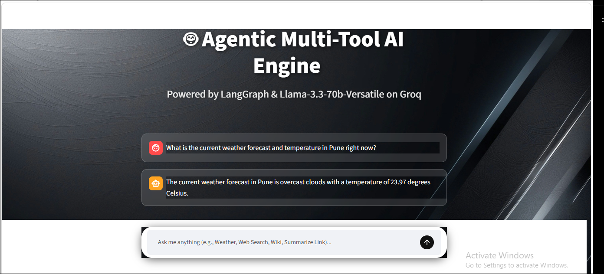
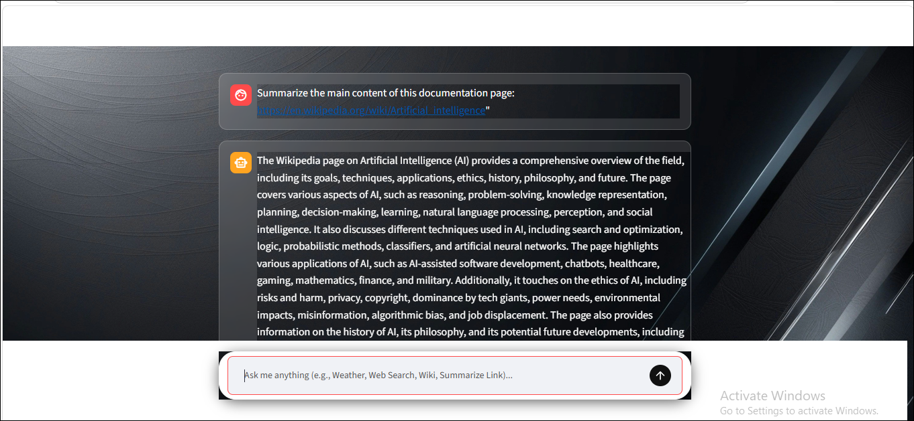
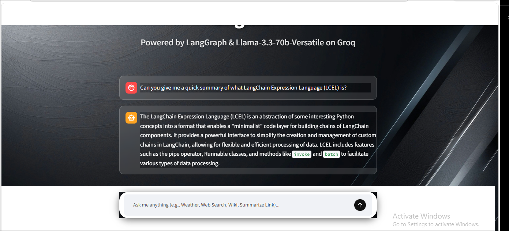
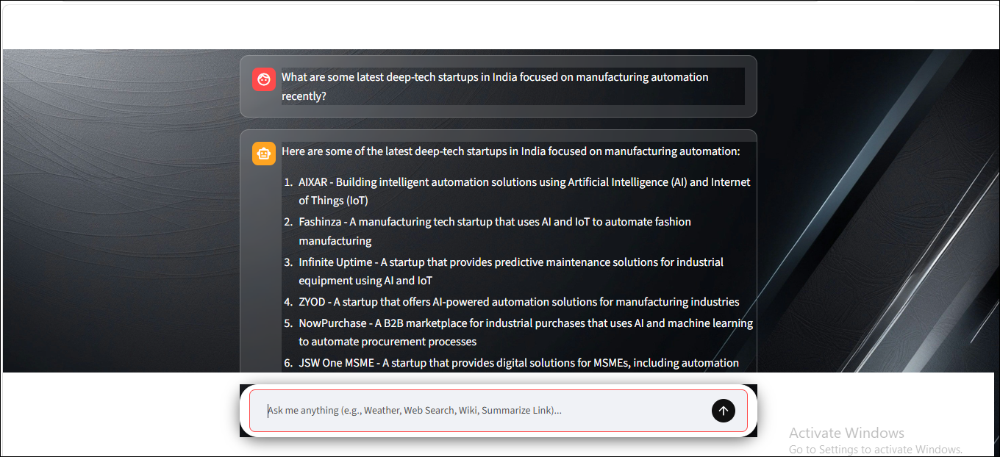

# 🤖 Langgraph Multi-Tool AI Engine

A production-ready **AI Agent** built using **LangGraph**, **Llama-3.3-70B-Versatile (Groq)**, and **Streamlit**. The application intelligently routes user requests to specialized tools such as live internet search, weather forecasting, Wikipedia knowledge retrieval, and website content extraction using LangGraph's agentic workflow.

---

# 🚀 Features

- 🧠 LangGraph Agent Workflow
- ⚡ Ultra-fast inference using Groq Llama-3.3-70B
- 💬 Persistent conversation memory
- 🌐 Live Internet Search (Tavily)
- 🌦️ Real-time Weather Information
- 📚 Wikipedia Knowledge Retrieval
- 🔗 Website URL Content Scraper & Summarizer
- 🎨 Beautiful Streamlit UI with Glassmorphism Design
- ⚙️ Modular Tool-Based Architecture

---

# 🏗️ System Architecture

```
                User Query
                     │
                     ▼
             LangGraph Agent
                     │
      ┌──────────────┼──────────────┐
      │              │              │
      ▼              ▼              ▼
 Internet      Weather API     Wikipedia
  Search            │              │
      │              │              │
      └──────────────┼──────────────┘
                     │
                     ▼
            Website Scraper
                     │
                     ▼
             Final AI Response
```

---

# 🛠️ Technology Stack

| Technology         | Purpose               |
| ------------------ | --------------------- |
| Python             | Backend               |
| LangGraph          | Agent Workflow        |
| LangChain          | LLM Integration       |
| Groq API           | Llama-3.3-70B Model   |
| Streamlit          | Web Interface         |
| Tavily API         | Internet Search       |
| OpenWeatherMap API | Live Weather          |
| Wikipedia          | Knowledge Retrieval   |
| BeautifulSoup4     | Website Scraping      |
| Requests           | HTTP Requests         |
| python-dotenv      | Environment Variables |

---

# 📂 Project Structure

```
agentic-multitool-ai-engine/

│
├── app.py
├── requirements.txt
├── .env
├── README.md
│
├── bg.jpg
│
├── weather_output.png
├── wikipedia_output.png
├── scraper_output.png
├── search_output.png
│
└── assets/
```

---

# 🧰 Available AI Tools

## 🌍 Internet Search

Uses **Tavily API** to retrieve live internet information.

Example:

```
Latest AI News
Who won IPL 2025?
Current Bitcoin Price
```

---

## 🌦️ Weather Tool

Uses **OpenWeatherMap API**.

Example

```
Weather in Pune
Temperature in London
Weather in Tokyo
```

Returns

- Temperature
- Weather Description
- City Name

---

## 📚 Wikipedia Tool

Retrieves concise summaries from Wikipedia.

Example

```
Artificial Intelligence

Machine Learning

Albert Einstein

Python Programming
```

---

## 🌐 Website Scraper

Extracts clean textual content from any website.

Example

```
https://openai.com

https://python.org

https://langchain.com
```

The tool automatically:

- Downloads HTML
- Removes scripts/styles
- Cleans text
- Returns summarized content

---

# 💾 Memory Support

The project uses

```
MemorySaver()
```

to preserve conversation history across the Streamlit session.

---

# 🎨 User Interface

Features include

- Glassmorphism Chat UI
- Background Image Support
- Responsive Layout
- White Rounded Chat Input
- Transparent Containers
- Smooth User Experience

---

# 📸 Application Screenshots

## 🌦️ Weather Tool



---

## 📚 Wikipedia Tool



---

## 🌐 Website Scraper



---

## 🔍 Internet Search



---

# ⚙️ Installation

## Clone Repository

```bash
https://github.com/atharvtaral/langgraph-multitool-agen

cd agentic-multitool-ai-engine
```

---

## Create Virtual Environment

### Windows

```bash
python -m venv venv

venv\Scripts\activate
```

### Linux / macOS

```bash
python3 -m venv venv

source venv/bin/activate
```

---

## Install Dependencies

```bash
pip install -r requirements.txt
```

---

# 🔑 Environment Variables

Create a `.env` file in the root directory.

```env
GROQ_API_KEY=YOUR_GROQ_API_KEY

TAVILY_API_KEY=YOUR_TAVILY_API_KEY

OPENWEATHER_API_KEY=YOUR_OPENWEATHER_API_KEY
```

---

# ▶️ Run Application

```bash
streamlit run app.py
```

Then open

```
https://langgraph-multitool-agen-1232.streamlit.app/
```

---

# 📦 Requirements

```text
streamlit
langgraph
langchain-core
langchain-groq
tavily-python
requests
python-dotenv
beautifulsoup4
wikipedia
```

Or simply install

```bash
pip install -r requirements.txt
```

---

# 🔄 LangGraph Workflow

```
START

↓

LLM

↓

Need Tool?

↓

YES ---------------------- NO

↓

Tool Execution

↓

LLM

↓

END
```

---

# ✨ Future Improvements

- Voice Assistant
- PDF Reader Tool
- Image Understanding
- SQL Database Tool
- RAG Pipeline
- Multi-Agent Collaboration
- Authentication
- Chat History Database
- Docker Support
- Deployment on Render / AWS

---

# 👨‍💻 Author

**Atharv Taral**

AI Engineer | Python Developer | LangGraph Enthusiast

GitHub:
https://github.com/atharvtaral

LinkedIn:
https://www.linkedin.com/in/atharv-taral-4546at/

---

# ⭐ Support

If you found this project useful,

⭐ Star the repository

🍴 Fork the project

🐞 Report Issues

💡 Suggest new features

---

# 📜 License

This project is licensed under the MIT License.

---

## 🚀 Built With ❤️ Using

- LangGraph
- Groq
- Streamlit
- LangChain
- Tavily
- Wikipedia
- BeautifulSoup
- OpenWeatherMap
